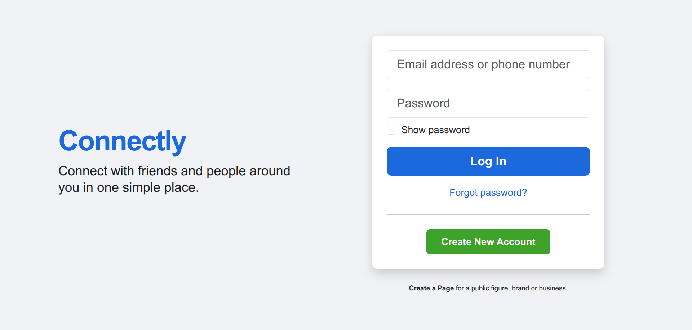
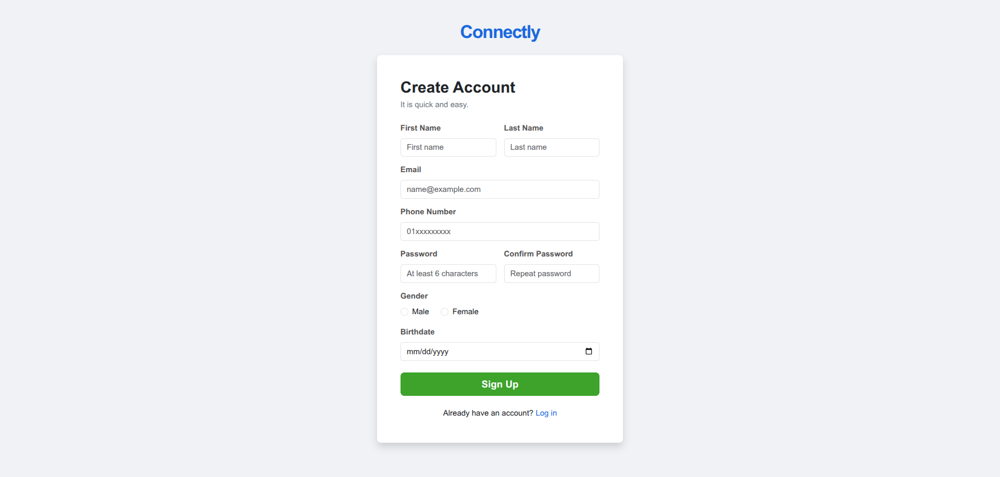

# Connectly — Bootstrap Login Assignment

A responsive Bootstrap 5 login and registration interface built to practice layout, forms, responsiveness, and basic client-side JavaScript validation.

> **DEPI Front-End Development Task**  
> This repository contains a practical assignment completed as part of the **Digital Egypt Pioneers Initiative (DEPI)** Front-End Development training track. It documents hands-on progress through the program and is intended as a learning/task submission rather than a production product.

## Demo

  
  

## Pages

- `index.html` — login form.
- `register.html` — sign-up form.
- `css/page.css` — small custom style layer on top of Bootstrap.
- `js/login-check.js` — basic login-form validation.
- `js/register-check.js` — basic registration-form validation.

## Technology

- HTML5
- CSS3
- Bootstrap 5 via CDN
- Vanilla JavaScript

## Run locally

No build step is required. Open `index.html` in a browser.

An internet connection is required for Bootstrap assets loaded from the CDN.

## Learning goals

The project intentionally keeps its JavaScript and page structure simple so the implementation remains appropriate for an introductory front-end assignment.

It demonstrates:

- responsive Bootstrap layout,
- form controls and validation feedback,
- separation of HTML, CSS, and JavaScript,
- a basic multi-page front-end flow.

## Security note

The forms are demonstrations only. There is no backend, database, password storage, session management, or real authentication.

---

**Training:** Digital Egypt Pioneers Initiative (DEPI) — Front-End Development Track  
**Author:** [Mohamed Anwar](https://github.com/mhmdwaelanwr)
